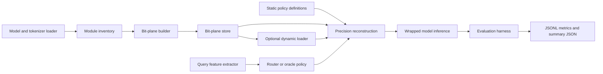

# High-Level Design

## Overview

This document designs a project-local QAQ prototype under `qaq/` for query-adaptive mixed-precision LLM inference. The design is based on `qaq/doc/proposal.md`, the repository `README.md`, the QAQ literature note, and existing experiment precedents in H6, H7, H9, and H10.

The confirmed target model for this design is `Llama-3.1-8B-Instruct`. Existing H9/H10 artifacts use the Hugging Face-style identifier `meta-llama/Llama-3.1-8B-Instruct`, so the HLD treats that as the default model identifier unless local access requires an override path.

The first deliverable is a readable PyTorch/Transformers research prototype, not a production kernel or vLLM integration. It should measure correctness, router behavior, memory footprint, latency, and quality against fixed-precision baselines, while keeping any CPU-to-GPU on-demand loading result separate from the core algorithm.

## Confirmed Inputs and Assumptions

- Confirmed by the user: the target model is `Llama-3.1-8B-Instruct`.
- Confirmed by the proposal: the initial deliverable is a readable, testable Python prototype under `qaq/`.
- Confirmed by repository state: dependencies are currently managed by root `requirements.txt`.
- Assumption from existing H9/H10 artifacts: `meta-llama/Llama-3.1-8B-Instruct` is the default Hugging Face model identifier, with local-path override support for gated or mirrored checkpoints.
- Assumption from the proposal: the first router operates at block or module-group granularity; the exact first grouping remains open.

## Goals

- Store selected Llama-3.1-8B-Instruct weight tensors as maximum-bit-width bit-plane representations with enough metadata for deterministic reconstruction.
- Reconstruct per-group weights from selected bit widths such as 2, 4, 6, and 8 bits.
- Support fixed policies before query-adaptive routing: all-8-bit, all-4-bit, and hand-authored mixed policies.
- Build a query-conditioned router that chooses a bit width per block or module group from reproducible query features.
- Generate oracle or offline labels by scoring candidate bit-width policies per calibration sample under a quality tolerance.
- Evaluate quality, memory, latency, and selected-bit distributions against static baselines.
- Write experiment outputs in the repository style: JSONL records plus summary JSON, with hardware labels kept explicit.

## Non-Goals

- Custom CUDA, Triton, vLLM, or kernel-level acceleration in the first version.
- Per-weight or per-channel routing in the first version.
- Claiming latency improvement from synchronous CPU-to-GPU loading before measurements support it.
- Replacing H9/H10 artifact-backed PTQ work; QAQ is a separate prototype focused on a single stored model with query-dependent bit-plane use.
- Production serving, batching scheduler design, or multi-tenant deployment behavior.

## Requirements Summary

| Area | Requirement |
| --- | --- |
| Model | Target `Llama-3.1-8B-Instruct`, defaulting to `meta-llama/Llama-3.1-8B-Instruct` when a Hugging Face identifier is needed. |
| Repository shape | Add a `qaq/` programming subproject that reuses root `requirements.txt` unless the project is later converted. |
| Quantization | Quantize selected weights up to an initial maximum of 8 bits and split integer values into ordered bit planes. |
| Reconstruction | Reconstruct approximate weights from top-k most significant planes for candidate widths including 2, 4, 6, and 8. |
| Baselines | Include static 8-bit, static 4-bit, hand-authored mixed policies, no-router, random-router, and oracle-label comparisons. |
| Router inputs | Start with input length, pooled embedding or early hidden state, optional activation outlier summaries, and optional prompt metadata. |
| Router objectives | Support supervised oracle labels first, with distillation-style KL or next-token cross entropy and cost penalty as a later path. |
| Metrics | Report quality, peak GPU memory, resident CPU storage, prefill/decode or end-to-end generation timing, and routing distribution. |
| Outputs | Write per-sample or per-run JSONL plus `summary.json`; preserve `hardware_label` and policy identifiers. |

## Proposed Architecture

The prototype is organized around an offline preparation path and an online/evaluation path.



The bit-plane store owns quantized tensor planes and metadata. Policy and router components never mutate the stored planes; they select reconstruction widths by group. The evaluation harness coordinates model loading, policy selection, inference, measurements, and result writing.

## Modules

| Module | Responsibility | Inputs | Outputs | Dependencies |
| --- | --- | --- | --- | --- |
| Configuration and CLI | Provide repeatable script entrypoints and run configuration. | Model name/path, dataset, group granularity, bit widths, seed, hardware label, output dir. | Parsed run config, copied config in result artifacts. | `argparse`, repo conventions. |
| Model Adapter and Inventory | Load tokenizer/model and discover selected linear modules or block groups. | `Llama-3.1-8B-Instruct` model, optional module filters. | Module inventory with names, shapes, group ids, roles. | Transformers, PyTorch. |
| Bit-Plane Builder | Quantize selected tensors to max width and split into ordered planes. | Float weight tensors, quantization config, group metadata. | Bit-plane tensors plus tensor metadata. | PyTorch. |
| Bit-Plane Store | Persist or hold planes and metadata for reconstruction and optional loading. | Plane tensors, scales/zero points, shapes, dtype, placement. | Addressable store keyed by tensor and group. | Local filesystem or in-memory tensors. |
| Precision Policy | Represent fixed and dynamic bit-width decisions per group. | Policy name or router output, group inventory. | Validated group-to-bit-width mapping. | Module inventory. |
| Reconstruction Engine | Reconstruct approximate tensors for selected groups and bit widths. | Bit-plane store, policy mapping, target dtype/device. | Reconstructed tensors ready for module execution. | Bit-plane store, PyTorch. |
| Model Wrapper | Replace or intercept selected linear-module weights during inference. | Base model, reconstructed tensors, selected policy. | Logits/generation outputs under the selected policy. | Transformers, reconstruction engine. |
| Query Feature Extractor | Compute deterministic features per input query. | Tokenized prompt, optional early hidden states, optional activation summaries. | Feature vector and feature metadata. | Model wrapper or base model. |
| Oracle Label Builder | Score candidate policies per calibration sample and choose minimal sufficient precision. | Calibration samples, candidate policy grid, quality tolerance. | Supervised labels and candidate score table. | Evaluation harness, model wrapper. |
| Router Trainer and Inference | Train or load a lightweight router and predict bit widths per group. | Feature rows, oracle labels, cost weights. | Router artifact, per-query policy decisions. | PyTorch. |
| Evaluation Harness | Run baselines, router policies, measurements, and ablations. | Dataset subset, policies, model config, seeds, hardware label. | Metrics JSONL, summary JSON, routing distribution artifacts. | All runtime modules. |
| Optional Dynamic Loader | Materialize selected planes on GPU from CPU storage per query. | Bit-plane store, selected policy, device config. | Reconstructed tensors on target device plus transfer metrics. | Reconstruction engine, PyTorch CUDA. |

## Module Relationships

- Configuration drives every module and must be serialized into result directories for reproducibility.
- Model Adapter and Inventory runs before Bit-Plane Builder because tensor selection and group ids depend on discovered model names.
- Bit-Plane Builder writes to Bit-Plane Store; later modules read through the store instead of reading original model weights directly.
- Precision Policy is the contract between fixed baselines, oracle labels, router predictions, reconstruction, and evaluation.
- Reconstruction Engine consumes a policy and the store, then provides tensors to the Model Wrapper.
- Query Feature Extractor can use token-only features without model execution, or model-derived features from an early pass when enabled.
- Oracle Label Builder depends on Evaluation Harness measurements over candidate policies; Router Trainer depends on oracle labels.
- Evaluation Harness is the top-level coordinator for static baselines, oracle runs, router evaluation, and optional dynamic loading.
- Optional Dynamic Loader is behind the same reconstruction interface so it can be measured without changing router logic.

## Data Flow

1. Load `Llama-3.1-8B-Instruct` and tokenizer from the configured model identifier or local path.
2. Discover selected modules and assign each module to a block, attention/MLP group, or linear-module group according to configuration.
3. Quantize selected weights to the maximum bit width and split the integer representation into ordered bit planes.
4. Store planes with metadata: tensor name, shape, quantization scale/zero point or symmetric scale, max bit width, group id, dtype, and placement.
5. Run static policies by reconstructing weights at fixed group bit widths and recording quality, memory, latency, and logits/generation diagnostics.
6. Build calibration features per prompt and score candidate policies to produce oracle labels.
7. Train or load the router, then predict a group-level policy for each evaluation query.
8. Run router-selected inference and write per-sample metrics, routing decisions, aggregate summaries, and hardware labels.
9. If enabled, rerun the selected policy path through the dynamic loader and report CPU/GPU memory and transfer latency separately.

## Interfaces and Contracts

### Module Inventory

The inventory should identify each selected tensor with:

```text
tensor_name
module_name
module_role
layer_idx
group_id
shape
source_dtype
target_quantized
```

### Bit-Plane Metadata

Each quantized tensor should carry:

```text
tensor_name
shape
quantization_scheme
scale
zero_point
max_bits
plane_order
storage_dtype
device_placement
group_id
```

### Policy Mapping

Policies should use group ids rather than raw tensor order:

```text
policy_name
model_name
group_granularity
group_bit_widths
default_bit_width
allowed_bit_widths
source
```

### Router Records

Router training and evaluation records should include:

```text
sample_id
prompt_metadata
features
oracle_label_or_predicted_policy
selected_group_bit_widths
expected_cost
quality_metric
```

### Evaluation Outputs

Per-run outputs should follow existing experiment conventions:

- `metrics.jsonl` for per-sample or per-step measurements.
- `summary.json` for aggregate quality, memory, latency, selected-bit distribution, model name, seed, and hardware label.
- Optional `policy_trace.json` for group decisions and reasons, matching the spirit of H6/H7 artifacts.

## Operational Considerations

- Hardware-specific metrics must be grouped by `hardware_label`; RTX 3090, A100, Colab, and CPU-only smoke results should not be combined as one deployment claim.
- Llama-3.1-8B-Instruct may require gated model access or a local path. The CLI should support both a Hugging Face id and a filesystem path.
- The prototype should support a tiny or dry-run mode for unit and wiring tests, but final design claims should use the requested Llama-3.1-8B-Instruct target.
- vLLM and artifact-backed GPTQ/AWQ results in H9/H10 can be used as comparison context, but QAQ's first wrapper should stay in Transformers/PyTorch because arbitrary query-conditioned bit-plane reconstruction is not currently established as a vLLM backend in this repo.
- Synchronous dynamic loading is expected to trade memory savings for latency overhead; report it as a separate experimental mode.

## Risks and Tradeoffs

- Reconstructing weights per query in Python may dominate latency, so early results may be algorithmic correctness evidence rather than deployment speed evidence.
- If group granularity is too fine, router output size and reconstruction overhead may make evaluation noisy; if too coarse, query adaptivity may be too weak.
- Oracle label generation can be expensive because it evaluates multiple policies per sample; a small calibration split and candidate grid are needed first.
- Feature extraction that requires an early model pass may erase part of the latency benefit; token-only features should remain available as a baseline.
- Llama-3.1-8B-Instruct hardware requirements can slow iteration; unit tests and toy-model smoke tests are still needed for correctness, but should be clearly labeled as non-target smoke runs.

## Validation Plan

1. Unit-test bit-plane split and reconstruction on toy signed and unsigned tensors, including exact reconstruction at max bit width.
2. Verify deterministic static logits for a fixed prompt, seed, and policy.
3. Compare static 4-bit, static 8-bit, and hand-authored mixed policies on a calibration subset.
4. Build oracle labels and confirm the selected labels obey the configured quality tolerance and cost ordering.
5. Train or fit the first router on a calibration split and evaluate on a held-out split.
6. Confirm the router beats at least one static baseline on the assignment metric, such as similar quality to static 8-bit with lower average selected bits, or better quality than static 4-bit at similar average bits.
7. If dynamic loading is enabled, report memory savings and latency overhead in separate summary fields and avoid merging them with the no-loader algorithmic results.

## Open Questions

1. Should final Llama-3.1-8B-Instruct runs use `meta-llama/Llama-3.1-8B-Instruct` directly, a local checkpoint path, or a pre-approved mirror?
2. Which hardware label is the primary target for final QAQ evidence: CPU-only smoke, RTX 3090, A100, or another machine?
3. What group granularity should be the first router target: transformer layer, attention vs MLP group, or individual linear-module group?
4. What quality tolerance defines "minimal sufficient precision" for oracle labels: the H6/H10-style 1% gate, an absolute NLL delta, or another assignment metric?
5. Which instruction or text calibration subset should be the default for Llama-3.1-8B-Instruct?
